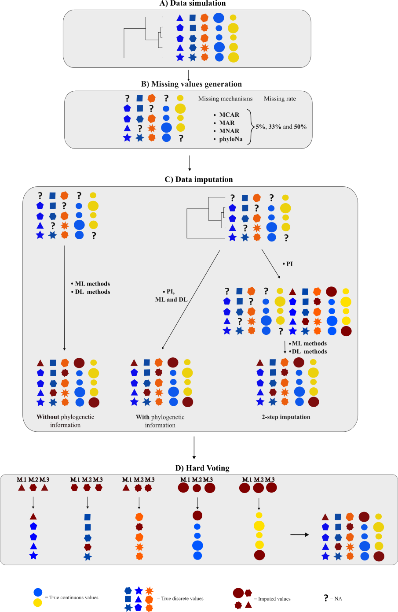
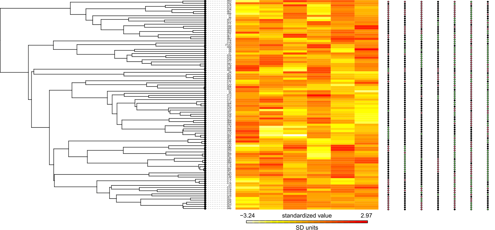
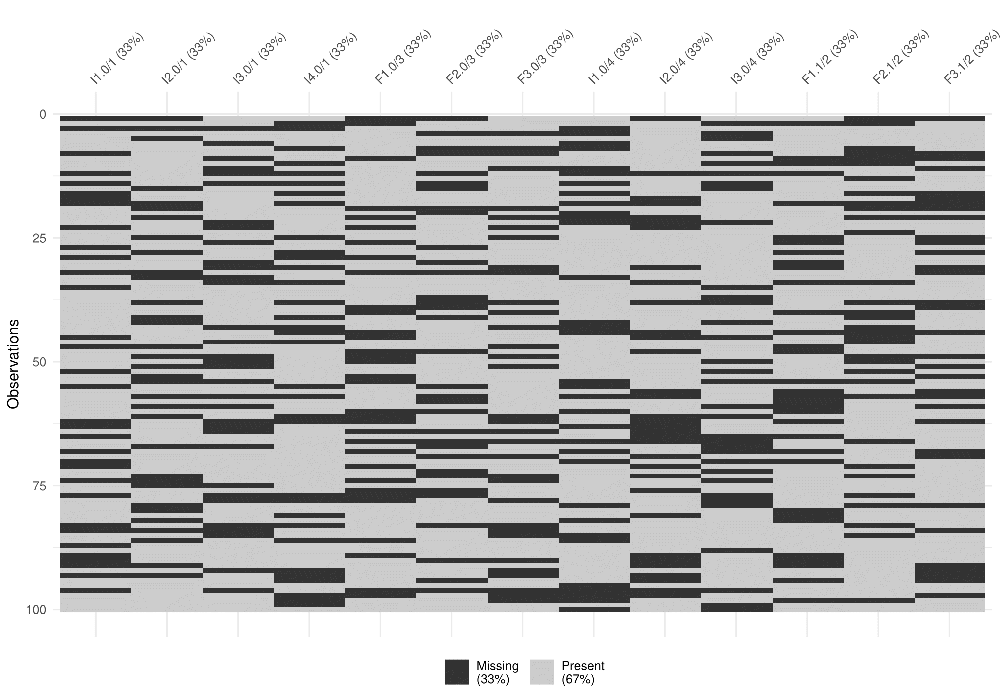
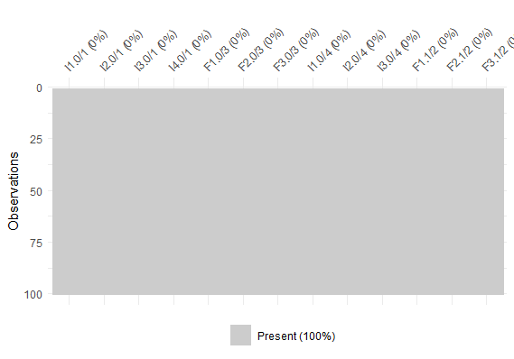

[](https://doi.org/10.5281/zenodo.10800016)
# Pipeline for the imputation of missing values in categorical traits

This repo provides the pipeline used to generate all the simulations and imputations of the paper **"Benchmarking imputation methods for categorical biological data"**. Most of the pipeline was build using functions coming from the [R package TDIP](https://anonymous.4open.science/r/TDIP-22D3/README.md). (Link for anonymization)

## Simulation part

Here is the command line to run the pipeline in order to reproduce the results obtained is the paper:

```{r setup}
Rscript --vanilla pipeline.R 0.05 TRUE 1
```

The arguments:

-   `Missing rate`: 0.05

-   `GAIN or not`: TRUE or FALSE

-   `Replicate`: integer defining the replicate number



The script automatically installs TDIP, which requires a Python installation with defined packages. Please check the repo of the R package for more information.

In this tutorial, you will see a brief explanation of the different methods and tools used. Before the first step called "Data simulation", different variables should be defined:

-   `tree_arg`: parameters for the phylogenetic tree simulation according to a birth death model
-   `varfrac`: the amount of fraction captured by the calculation of the eigenvector from the phylogenetic tree.
-   `strategies`: type of strategies (NP = no phylogeny, P = with phylogeny and 2-step)
-   `ImputationApproachesNames`: vector containing the names of the imputation functions that we want to use. The names are the names of the TDIP package functions.

```{r setup}
#tree parameters
tree_arg <- list(Birth = 0.4, Death = 0.1, Ntaxa = 100)
varfrac <- as.numeric(0.95)

#strategies can be "NP", "P" or "2-step"
strategies <- c("NP", "P", "2-step")

ImputationApproachesNames <- c("pi_categorical_traits", "pi_continuous_traits", "mice_phylo", "missForest_phylo",
                                "kNN_phylo")


if(gain){
  ImputationApproachesNames <- c("pi_categorical_traits", "pi_continuous_traits", "mice_phylo", "missForest_phylo",
                                 "kNN_phylo", "gain_phylo")
}

```

In addition, several directories should be created to store the various generated data as `.RData` files as well, the input files which were `.csv` files stored in a directory called "csv", are loaded in a list called `datasetList`.

### A) Data simulation

The entire pipeline run through all the input files using a for loop.

The input file is a table composed of various columns:

-   `nbr_traits`: number of traits simulated with specific parameters

-   `class`: type of traits, (continuous, non_eq_nominal (categorical) and ordinal)

-   `model`: evolutionary models (BM1, OU1, ARD, SYM, ER, Na)

-   `states`: number of states for categorical traits, (if continuous set it to 1)

-   `correlation`: index corresponding to the group of simulated traits which are correlated or not to other traits

-   `uncorr_traits`: the number of uncorrelated traits among the "nbr_traits" row.

-   `fraction_uncorr_traits`: fraction of traits among the "nbr_traits" which are uncorrelated

-   `lambda`: Pagel's lambda

-   `kappa`: Pagel's kappa

-   `highCor`: correlation rate between the trait defined in "manTrait" and the simulated traits.

-   `manTrait`: index of the row (in the `input_data`) corresponding to the trait with which the traits will be correlated.

In this tutorial, we simulates 13 traits, 1 categorical trait composed of 3 states, 3 uncorrelated categorical traits, 3 categorical trait composed of 3 states and highly correlated to the first trait, 6 continuous traits: 3 correlated with the first trait and 3 not correlated. All the traits will be generated in presence of a strong phylogenetic signal.

```{r}
input_data <- read.csv("csv/DiscreteARD1Data.csv", header = T, sep = ";")
head(input_data)
```

| nbr_traits | class          | model | states | correlation | uncorr_traits | fraction_uncorr_traits | lambda | kappa | highCor | manTrait |
|---------|-------------|-------|-------|-----------|------------|-------------------|--------|-------|---------|----------|
| 4          | non_eq_nominal | ARD   | 3      | 0           | 4             | 0                      | 1      | 1     | 0       | 0        |
| 3          | non_eq_nominal | Na    | 3      | 0           | 0             | 0                      | 1      | 1     | 0.8     | 1        |
| 3          | continuous     | Na    | 1      | 0           | 0             | 0                      | 1      | 1     | 0.8     | 1        |
| 3          | continuous     | BM1   | 1      | 2           | 3             | 0                      | 1      | 1     | 0       | 0        |

The function used to simulate a phylogenetic tree and traits according to the input file is `TDIP::data_simulator()`. To remember, the tree will be composed of 100 species.

```{r}
simulatedData <- TDIP::data_simulator(tree_arg, input_data)
```

We have then a trait dataset composed of 13 traits. More precisely, composed of 7 categorical traits and 6 continuous traits.

```{r}
head(simulatedData$FinalData, 3)
```

|     | **I1.0/1** | I2.0/1 | I3.0/1 | I4.0/1 | **I1.0/2** | I2.0/2 | I3.0/2 | F1.0/3 | F1.0/3 | F1.0/3 | F1.0/4 | F2.2/4 | F3.2/4 |
|:-----|------|------|-------|-------|------|------|--------|------|-------|-------|-------|-------|-------|
| t8  | 1          | 2      | 1      | 0      | 2          | 2      | 0      | -0.531 | -0.869 | -0.899 | -0.260 | -0.442 | 1.188  |
| t91 | 1          | 2      | 1      | 0      | 2          | 0      | 1      | -0.102 | -1.237 | 0.322  | -0.294 | -0.121 | 1.339  |
| t92 | 1          | 1      | 1      | 0      | 1          | 1      | 1      | -0.326 | -1.145 | -0.024 | 0.869  | 0.281  | 2.104  |

The columns are named according to this notation:

-   `I` : integer or `F:` float (continuous)

-   `1`: trait index among the group of traits generated

-   `.0` : correlation group

-   `/1`: the corresponding row in the `input_data` file.

Here is a representation of the phylogenetic tree + the simulated traits

{width="1071"}

### B) Missing value generation

For the example, we are going to generate missing values according to 4 missing mechanisms with a missing rate of 33%. For this we will use the function `TDIP::na_insertion()`.

```{r}
NaNData <- TDIP::na_insertion(missingRates,
                              dataset = simulatedData$FinalData,
                              missingTraits = ncol(simulatedData$FinalData),
                              MARTraits = 1,
                              MARctrlTraits = 
                                sample(2:ncol(simulatedData$FinalData) ,1),
                              traitsNoNA = NULL,
                              tree = simulatedData$TreeList$`0`)
```

Here is the example of the missing data distribution according to a MCAR (=missing completely at random) mechanism and a missing rate of 33%.

```{r}
plot(vis_miss(NaNData$DataNaN$MCAR$`MCAR/13/0.33`))
```

{width="569"}

### C) Data imputation

For the imputation, the pipeline provides several imputation strategies (NP = no phylogeny, P = with phylogeny and 2-step) and several imputation methods like **corHMM**, **Rphylopars**, **MICE**, **kNN**, **missForest** and **GAIN**.

The pipeline through a nested loop, use the function `TDIP::missing_data_imputation` to impute each dataset containing missing values.

```{r}
mecList <- vector("list", length(NaNData$DataNaN))
names(mecList) <- names(NaNData$DataNaN)
errorList <- vector("list", length(NaNData$DataNaN))
names(errorList) <- names(NaNData$DataNaN)
namesMethods <- c("MICE", "MissForest", "KNN") #select the method that we want to ensemble

for(mC in 1:length(NaNData$DataNaN)){
  for(d in 1:length(NaNData$DataNaN[[mC]])){
    data <- NaNData$DataNaN[[mC]][[d]]
    imputedData <- TDIP::missing_data_imputation(ImputationApproachesNames,
                                                 data,
                                                 tree = simulatedData$TreeList$`0`,
                                                 strategies,
                                                 maxit = 5,
                                                 nbrMI = 1,
                                                 k = 3,
                                                 numFun = laeken::weightedMedian,
                                                 catFun = VIM::maxCat,
                                                 mincor = NULL,
                                                 varfrac = varfrac,
                                                 save = NULL)

    imputedName <- paste0("imputed_", names(NaNData$DataNaN[[mC]])[d])

    #hard voting
    strategies_HV <- c("NP", "mixed")
    for(s in 1:length(strategies_HV)){
      if(strategies_HV[s] == "mixed"){
        namesToselect <- c("MissForest_NP", "KNN_2-step", "MICE_2-step")
      }
      else{
        namesToselect <- paste(namesMethods, strategies_HV[s], sep = "_")
      }

      namesImputedData <- names(imputedData)
      datasets <- imputedData[which(namesImputedData %in% namesToselect)]
      print(paste("length datasets:", length(datasets)))
      print(names(datasets))
      HVData <- list(TDIP::hard_voting(datasets))
      names(HVData) <- paste0("HV.ML_", strategies_HV[s])
      imputedData <- c(imputedData, HVData)

    }

    errorData <- vector("list", length(imputedData))
    errorName <- c()

    for(impD in 1:length(imputedData)){
      imputationApproachName <- names(imputedData)[impD]
      error <- TDIP::imputation_error(imputedData[[impD]],
                                      simulatedData$FinalData,
                                      data,
                                      imputationApproachName,
                                      simulatedData$Dataframe)

      errorN <- paste0("error_", imputationApproachName)
      errorData[[impD]] <- error
      errorName <- c(errorName, errorN)

    }

    names(errorData) <- errorName
    mecList[[mC]][[d]] <- imputedData
    names(mecList[[mC]])[d] <- imputedName
    errorList[[mC]][[d]] <- errorData
    names(errorList[[mC]])[d] <- paste0("error_", names(NaNData$DataNaN[[mC]])[d])

  }

}
```

### D) Hard Voting

It is important to highlight the methods that we want to use for the Hard Voting. In this example, we selected **MICE**, **missForest** and **kNN** according to the strategies **NP** and **2-step.** Therefore, we kept only the imputation resulting of **missForest_NP**, **KNN_2-step** and **MICE_2-step.** For hard voting, we used the function `TDIP::hard_voting()`.

After imputation, the Hard Voting output showed that all the values were imputed.

```{r}
plot(vis_miss(errorList$imputedData$MCAR$`imputed_MCAR/13/0.33`$HV.ML_mixed))
```



### E) Error calculation

To calculate the imputation error, we used 2 metrics:

\- For **categorical traits**: proportion of correct (or erroneous) imputations out of the total number of imputed values.

\- For **continuous traits**: the absolute error.

The function used was `TDIP::imputation_error()`.

------------------------------------------------------------------------

## Empirical part

When we do an analysis with real data, the only thing that we want, is to impute missing values. With the R package `TDIP` this task is easy to perform.

### 1) Data preprocessing

In `TDIP`, there is a function called `data_preprocessing()` which:

-   Converts character and integer values as factors

-   Apply a log transformationof the continuous traits

-   Converts the phylogenetic tree in an ultrametric tree

```{r}
preprocessed_data <- data_preprocessing(data, tree, no.conv.factor = NULL, save = NULL)
```

### 2) Missing data imputation

In the package there is a panel of imputation methods. Let impute data using 3 imputation methods: MICE+PI, missForest and kNN+PI

```{r}

missing_data <- preprocessed_data$FinalData
ultrametric_tree <- preprocessed_data$TreeList$`0`


#One by one
###########

# if data contains factors traits
data_imputed_corHMM <- pi_categorical_traits(missing_data, 
                                         ultrametric_tree)

# if data contains numerical traits
data_imputed_phylopars <- pi_categorical_traits(missing_data, 
                                                ultrametric_tree)

#MICE+PI
data_imputed_micePI <- mice_phylo(missing_data, 
                                  nbrMI = 1, 
                                  variance_fraction = 2, 
                                  tree = NULL, 
                                  maxit = 5, 
                                  mincor = 0.6,  
                                  hint = cbind(contiImputed$imputedData, 
                                               data_imputed_corHMM$probabilities))

#missForest
data_imputed_MF <- missForest_phylo(missing_data, variance_fraction = 0, 
                                    maxiter = 10, 
                                    ntree = 100, 
                                    mtry = sqrt(ncol(missing_data)), 
                                    tree = NULL, 
                                    hint = NULL)

#kNN
data_imputed_kNNPI <- kNN_phylo(missing_data, 
                              k = 3, 
                              numFun = laeken::weightedMedian, 
                              catFun = VIM::maxCat, 
                              variance_fraction = 0,
                              tree = NULL, 
                              hint = cbind(contiImputed$imputedData, 
                                          data_imputed_corHMM$probabilities))


# Faster way
############

#Define the strategies
strategies <- c("NP", "2-step")

#Provide the methods
ImputationApproachesNames <- c("pi_continuous_traits", 
                               "pi_categorical_traits", 
                               "missForest_phylo", 
                               "kNN_phylo", 
                               "mice_phylo")

#Impute
vI <- TDIP::missing_data_imputation(ImputationApproachesNames, 
                                    missing_data, 
                                    tree = ultrametric_tree,
                                    strategies, 
                                    mincor = 0.6,
                                    save = NULL)
```

Then, to have a **Hard Voting** imputation, you can use the function `TDIP::hard_voting()`

```{r}
#Create a list of datasets
datasets <- list(data_imputed_micePI$imputedData, 
                 data_imputed_MF$imputedData,
                 data_imputed_kNNPI$imputedData)

HVData <- TDIP::hard_voting(datasets)

#OR
HVData <- TDIP::hard_voting(vI)
```
